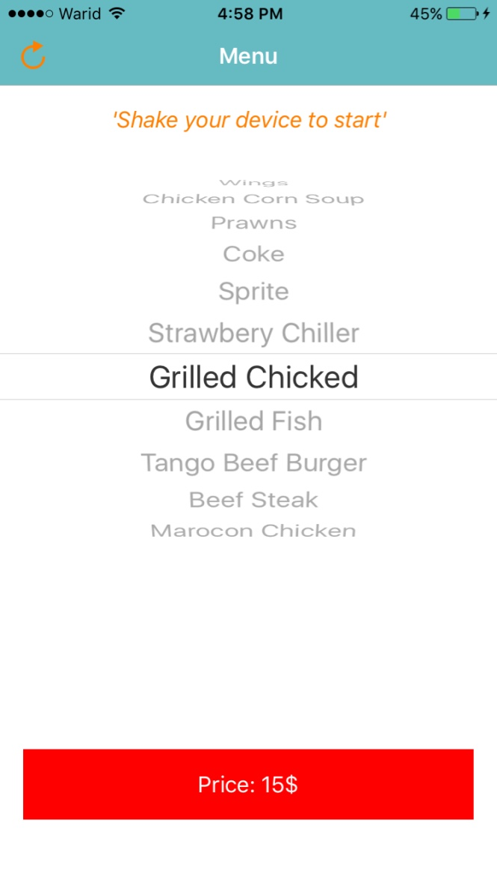
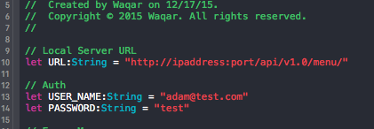

# MenuApp

This is the fun application. The idea behind is `What would you like to eat?` that is common problem.

Just shake your iPhone deivce and let's decieded!

## Install
 
Kindly make sure you have setup the [Virtual Environment](http://docs.python-guide.org/en/latest/dev/virtualenvs/).

Install the python packages that we have mentioned in `requirements.txt`

## Usage

I hope you have setup your virtual environment. Now activate that environment and go into the HotelServices
directory

	$ python manage.py runserver --host=ipaddress

	
Now enter the url in the browser 

	http://ipaddress:port/api/v1.0/menu/
	Credentials:
		username: adam@test.com
		password: test
		
Update the ipaddress and port in Swift.constant

	
## Reached Me	

I can be reached at `waqar.zahour@gmail.com`
